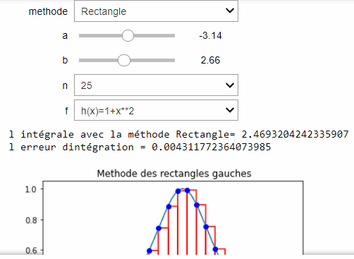

# TP3
<!-- START doctoc generated TOC please keep comment here to allow auto update -->
<!-- DON'T EDIT THIS SECTION, INSTEAD RE-RUN doctoc TO UPDATE -->
>Il existe de nombreuses méthodes pour réaliser une intégration numérique. Nous allons considérer ici quelques méthodes simples.
# methode de triangle:
>Dans cette méthode, on calcule l’intégrale numérique en réalisant une somme de surfaces de rectangles. Le domaine d’intégration est découpé en intervalles et on fait comme si la >fonction restait constante sur chaque intervalle.
# methode de trapéze:
>Comme son nom l’indique, cette méthode d’intégration utilise une somme de surfaces de trapèzes.
# méthode de simpson:
>Pour obtenir la formule de Simpson, on va réaliser une interpolation avec un polynôme de degré 2. Un polynôme étant une fonction très facile à intégrer, on approche l’intégrale >de la fonction  sur l’intervalle , par l’intégrale du polynôme sur ce même intervalle.
# méthode de point milieu:
>voila la démentstration de calcule de chaque méthode:

